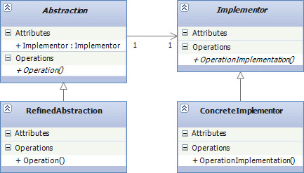

# Structural Design Patterns

## Bridge

* **Използване:**
	- Използва се, когато е необходима лесна и бърза подмяна на една имплементация с друга, без да е необходимо цялостно да се познава програмата.
	
* **Цел:**
	- Отделяне на абстрактните елементи на един клас от неговата имплементация. Това предлага по изчистена имплементация на обекти от риалният свят и позволява имплементационните детайли да бъдат лесно подменяни. 

* **Приложение:**
    - програма, която записва обекти върху различни платфоми. Някои обекти трябва да се запишат в база данни, а други в файлова система
	
* **Имплементация**
	~~~c#
	public class Message
	{
	    protected MessageSenderBase messageSender { get; set; }
	    public string Title { get; set; }
	    public string Body { get; set; }
	    public int Importance { get; set; }

	    public Message()
	    {
	        messageSender = new EmailSender();
	    }

	    public virtual void Send()
	    {
	        messageSender.SendMessage(Title, Body, Importance);
	    }
	}

	public class EmailSender : MessageSenderBase
	{
	    public override void SendMessage(string title, string body, int importance)
	    {
	        Console.WriteLine("Email\n{0}\n{1}\n{2}\n", title, body, importance);
	    }
	}

	public class MsmqSender : MessageSenderBase
	{
	    public override void SendMessage(string title, string body, int importance)
	    {
	        Console.WriteLine("MSMQ\n{0}\n{1}\n{2}\n", title, body, importance);
	    }
	}

	public class WebServiceSender : MessageSenderBase
	{
	    public override void SendMessage(string title, string body, int importance)
	    {
	        Console.WriteLine("Web Service\n{0}\n{1}\n{2}\n", title, body, importance);
	    }
	}

	public abstract class MessageSenderBase
	{
	    public abstract void SendMessage(string title, string details, int importance);
	}

	public class UserEditedMessage : Message
	{
	    public string UserComments { get; set; }

	    public UserEditedMessage(MessageSenderBase messageSender)
	    {
	        this.messageSender = messageSender;
	    }

	    public override void Send()
	    {
	        string fullBody = string.Format("{0}\nCOMMENTS\n{1}", Body, UserComments);
	        messageSender.SendMessage(Title, fullBody, Importance);
	    }
	}
	class Program
	{
	    static void Main()
	    {
	        var listOfMessages = new List<Message>
	                                 {
	                                               new Message
	                                                   {
	                                                       Body = "Hello World 1",
	                                                       Importance = 1,
	                                                       Title = "Hello World Title 1"
	                                                   },
	                                               new UserEditedMessage(new EmailSender())
	                                                   {
	                                                       Body = "User Edited Message",
	                                                       Importance = 3,
	                                                       UserComments = "Comments",
	                                                       Title = "User Edited Title"
	                                                   }
	                                           };
	        foreach (var message in listOfMessages)
	        {
	            message.Send();
	        }
	    }
	}
	~~~

* **Участници**
	- Message - клас, абстракция за UserEditedMessage
	- MessageSenderBase - имплементатор и абстрактен клас за всички конкретни класове "message senders"
	- EmailSender, MsmqSender, WebServiceSender - "message senders"

* **Структура**
	
	

	- Abstraction: дефинира абстрактен интерфейс. Базов клас за всички по-конкретни абстрактни класове. Съдържа референция към някъква имплементация
	- RefinedAbstraction: по-високо ниво на абстракция, не съдържа имплементационни детайли
	- Implementor: дефинира интерфейс за имплементационни класове
	- ConcreteImplementor: наследява RefinedAbstraction. Може да има повече инстанции на Implementor класа със същия интерфейс но с различна имплементация.