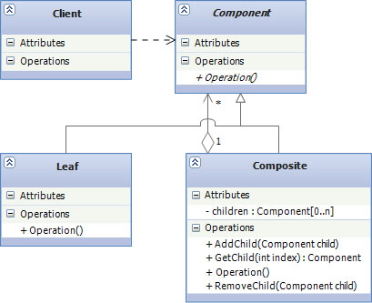

# Structural Design Patterns

## Composite

* **Използване:**
	- Използва се когато, създават обекти подредени д дървовидна структура. По този модел се създават рекурсивни дървовидни структури от обекти, като индивидуалните обекти и групите от обекти могат да се достъпват по един и същ начин.

* **Цел:**
	- Целта на този модел е да се събират обекти в дървовидни структури, които представляват цялостни йерархии. Позволява на клиента да манипулира единичен обект(листо) и група от обекти(композит) по еднакъв начин.

* **Приложение:**
    - Най често се използва в графични едитори или библиотеки
    - Windows.Forms.Control
	- System.Web.UI.Control
	- System.Xml.XmlNode

	
* **Имплементация**
	~~~c#
	public interface IShape
	{
	    string Name { get; set; }
	    void Render(int depth);
	}

	public class ComplexShape:IShape
	{
	    public ComplexShape(string name)
	    {
	        Name = name;
	    }

	    private readonly List<IShape> shapes = new List<IShape>();

	    public string Name { get; set; }

	    public void Render(int depth)
	    {
	        Console.WriteLine(new String('-', depth) + Name);
	        foreach (var shape in shapes)
	        {
	            shape.Render(depth+1);
	        }
	    }

	    public void AddShape(IShape shape)
	    {
	        shapes.Add(shape);
	    }

	    public void RemoveShape(IShape shape)
	    {
	        shapes.Remove(shape);
	    }
	}

	public class Circle : IShape
	{
	    public Circle(string name)
	    {
	        Name = name;
	    }

	    public string Name { get; set; }

	    public void Render(int depth)
	    {
	        Console.WriteLine(new String('-', depth) + Name);
	    }
	}

	public class Line : IShape
	{
	    public Line(string name)
	    {
	        Name = name;
	    }

	    public string Name { get; set; }

	    public void Render(int depth)
	    {
	        Console.WriteLine(new String('-', depth) + Name);
	    }
	}

	public class Rectangle:IShape
	{
	    public Rectangle(string name)
	    {
	        Name = name;
	    }

	    public string Name { get; set; }

	    public void Render(int depth)
	    {
	        Console.WriteLine(new String('-', depth) + Name);
	    }
	}

	class Program
	{
	    static void Main(string[] args)
	    {

	        ComplexShape shape1= new ComplexShape("Complex Shape #1");
	        Line line1 = new Line("Blue Line #1");
	        Line line2 = new Line("Blue Line #2");

	        shape1.AddShape(line1);
	        shape1.AddShape(line2);

	        ComplexShape shape2 = new ComplexShape("Complex Shape #2");
	        Circle circle1 = new Circle("Yellow Circle #1");
	        shape2.AddShape(circle1);
	        shape1.AddShape(shape2);

	        shape1.Render(1);
	    }
	}
	~~~

* **Участници**
	- IShape: интерфейс който обединява различните компоненти. Всички композити и листа трябва да го имплементират.
	- ComplexShape - клас композитен елемент.
	- shapes: private поли на класа ComplexShape - колекция от единични елементи които наследяват IShape. 
	- AddShape() и RemoveShape() - методи на класа ComplexShape които се грижат за колекцията shapes.
	- Render(): метод на IShape, който бива викан рекурсивно във всечки елементи в колекцията shapes.
	- Rectangle, Circle и Line: са класове листа.
	
* **Структура**
	
	

	- Component: абстракция на всички компоненти, включително композитни такива
	- Composite: композитен елемент, има под-елементи, имплементира Component и методи за добавяни и махане на под-елементи 
	- Leaf: представлява обект "листо"(единичен обект), имплементира Component.
	