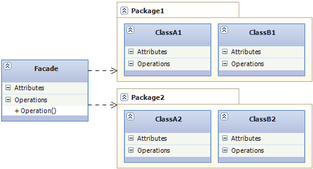

# Structural Design Patterns

## Facade

* **Използване:**
	- Олеснява достъпа до функционалността на сложни или лошо конструирани подсистеми. Класът "фасада" предоставя прост, еднокласов интерфейс който скрива имплементационните детайли на подсистемата.

* **Цел:**
	- Да предостави опростен интерфейса за достъп до голям обем код. 
    - Да направи кода по лесен за използване и разбиране.

* **Приложение:**
    - Използва сe в много Win32 API-базирани класове 
	- В XmlSerializer (в .Net) и JSON serializer (в JSON.NET) скрива сложна програмна логика зад лесен за използване клас
	
* **Имплементация**
	~~~c#
	public class Computer
	{
	    private readonly CPU cpu;
	    private readonly HardDrive hardDrive;
	    private readonly Memory memory;

	    private const long BootAddress = 1;
	    private const long BootSector = 1;
	    private const int SectorSize = 10;

	    public Computer()
	    {
	        cpu = new CPU();
	        hardDrive = new HardDrive();
	        memory = new Memory();
	    }

	    public void Start()
	    {
	        cpu.Freeze();
	        memory.Load(BootAddress, hardDrive.Read(BootSector, SectorSize));
	        cpu.Jump(BootAddress);
	        cpu.Execute();
	    }
	}

	public class CPU
	{
	    public void Freeze()
	    {
	        Console.WriteLine("CPU is frozen");
	    }

	    public void Jump(long position)
	    {
	        Console.WriteLine("Jumping to position: {0}", position);
	    }

	    public void Execute()
	    {
	        Console.WriteLine("Executing...");
	    }
	}

	public class HardDrive
	{

	        public byte[] Read(long lba, int size)
	        {
	            var bytes = new byte[size];
	            var random = new Random();
	            random.NextBytes(bytes);
	            return bytes;
	        }
	}

	public class Memory
	{
	    public void Load(long position, byte[] data)
	    {
	        Console.WriteLine("Loading data: ");
	        foreach (var b in data)
	        {
	            Console.Write(b+ " ");
	            Thread.Sleep(1000);
	        }

	        Console.WriteLine("\nLoading compleded");
	    }
	}

	class Program
	{
	    static void Main()
	    {
	        var computer = new Computer();
	        computer.Start();
	    }
	}
	~~~

* **Участници**
	- Computer: клас, който служи за "фасада" която покрива (енкапсулира) други сложни класове:
	HardDrive, Memory и CPU. Всеки от тях трябва да извърши точно определени задачи, гогато бъде извикан методът Start() от класа Computer.

* **Структура**
	
	

	- Facade: Този клас съдържа набор от прости функции достъпни до потребителя, които скриват сложните подсистеми.
	- PackageA/B: Сложната функционалност която стои под "фасадата" може да бъде пръсната во повече от едно асембли съдържащо много класове.
	- ClassA/B: Това са класовете които съдържат функционалноста предоставена от "фасадата".