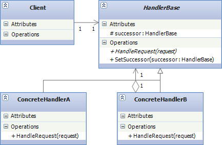

# Behavioral Design Patterns

## Chain of Responsibility

* **Цел:**

	Този модел помага за създаването на верига от обекти които се подреждат йерархично. Когато бъде отправена заявка към първия, при невъзможност той да я обработи, я праща на следващия нагоре по веригата и така докато някой обработи заявката.

* **Използване:**
	
	Когато събитие, генерирано от обект е необходимо да се обработи от друг обект. В този модел, имаме източник на командни и поредица от обекти които ги обработват. Командата се подава на първия обект, той може да я обработи или да я изпрати на следващия по виригата. Това продължава докато командата не се обработи или се достигне края на веригата. В този модел, обектът, който изпраща командата не се интересува кой обект ще я обработи.

* **Имплементация**
	~~~c#
	public class FivePenceHandler : CoinHandlerBase
	{
	    public override CoinEvaluationResult EvaluateCoin(Coin coin)
	    {
	        if (Math.Abs(coin.Weight - 3.25) < 0.02 && Math.Abs(coin.Diameter - 18) < 0.1)
	        {
	            Console.WriteLine("Captured 5p");
	            return CoinEvaluationResult.Accepted;
	        }
	        if (_successor != null)
	        {
	            return _successor.EvaluateCoin(coin);
	        }
	        return CoinEvaluationResult.Rejected;
	    }
	}

	public class TenPenceHandler : CoinHandlerBase
	{
	    public override CoinEvaluationResult EvaluateCoin(Coin coin)
	    {
	        if (Math.Abs(coin.Weight - 6.5) < 0.03 && Math.Abs(coin.Diameter - 24.5) < 0.15)
	        {
	            Console.WriteLine("Captured 10p");
	            return CoinEvaluationResult.Accepted;
	        }
	        if (_successor != null)
	        {
	            return _successor.EvaluateCoin(coin);
	        }
	        return CoinEvaluationResult.Rejected;
	    }
	}

	public class TwentyPenceHandler : CoinHandlerBase
	{
	    public override CoinEvaluationResult EvaluateCoin(Coin coin)
	    {
	        if (Math.Abs(coin.Weight - 5) < 0.01 && Math.Abs(coin.Diameter - 21.4) < 0.1)
	        {
	            Console.WriteLine("Captured 20p");
	            return CoinEvaluationResult.Accepted;
	        }
	        if (_successor != null)
	        {
	            return _successor.EvaluateCoin(coin);
	        }
	        return CoinEvaluationResult.Rejected;
	    }
	}
	 
	public class FiftyPenceHandler : CoinHandlerBase
	{
	    public override CoinEvaluationResult EvaluateCoin(Coin coin)
	    {
	        if (Math.Abs(coin.Weight - 8) < 0.02 && Math.Abs(coin.Diameter - 27.3) < 0.15)
	        {
	            Console.WriteLine("Captured 50p");
	            return CoinEvaluationResult.Accepted;
	        }
	        if (_successor != null)
	        {
	            return _successor.EvaluateCoin(coin);
	        }
	        return CoinEvaluationResult.Rejected;
	    }
	}

	public class OnePoundHandler : CoinHandlerBase
	{
	    public override CoinEvaluationResult EvaluateCoin(Coin coin)
	    {
	        if (Math.Abs(coin.Weight - 9.5) < 0.02 && Math.Abs(coin.Diameter - 22.5) < 0.13)
	        {
	            Console.WriteLine("Captured £1");
	            return CoinEvaluationResult.Accepted;
	        }
	        if (_successor != null)
	        {
	            return _successor.EvaluateCoin(coin);
	        }
	        return CoinEvaluationResult.Rejected;
	    }
	}
	
	public abstract class CoinHandlerBase
	{
	    protected CoinHandlerBase _successor;

	    public void SetSuccessor(CoinHandlerBase successor)
	    {
	        _successor = successor;
	    }

	    public abstract CoinEvaluationResult EvaluateCoin(Coin coin);
	}

	public class Coin
	{
	    public float Weight { get; set; }
	    public float Diameter { get; set; }
	}
	 
	class Program
	{
	    static void Main()
	    {
	        var h5 = new FivePenceHandler();
	        var h10 = new TenPenceHandler();
	        var h20 = new TwentyPenceHandler();
	        var h50 = new FiftyPenceHandler();
	        var h100 = new OnePoundHandler();
	        h5.SetSuccessor(h10);
	        h10.SetSuccessor(h20);
	        h20.SetSuccessor(h50);
	        h50.SetSuccessor(h100);

	        var tenPence = new Coin { Diameter = 24.49F, Weight = 6.5F };
	        var fiftyPence = new Coin { Diameter = 27.31F, Weight = 8.01F };
	        var counterfeitPound = new Coin { Diameter = 22.5F, Weight = 9F };

	        Console.WriteLine(h5.EvaluateCoin(tenPence)); 
	        Console.WriteLine(h5.EvaluateCoin(fiftyPence));
	        Console.WriteLine(h5.EvaluateCoin(counterfeitPound));
	    }
	}

	public enum CoinEvaluationResult
	{
	    Accepted,
	    Rejected
	}
	~~~

* **Участници**
	Примера предсавлява монетник на вендинг машина.
	- Coin - Клас с два параметъра Weight и Diameter. Представлява обекта който трябва да се евалюира.
	- CoinHandlerBase - Абстрактен клас, с метод SetSuccessor(), с който се определя наследника му нагоре по 	веригата и абстрактен метод EvaluateCoin()
	- FiftyPenceHandler, ..., OnePoundHandler - Директни имплементации на CoinHandlerBase. Всеки евалюира Coin по различен начин и ако не може я праща на следващия.

* **Структура**
	
	

	- Client - Този клас подава команди(или заявки) към първия обект от веригата.

	- HandlerBase - Интерфейс или базов клас на всички конкретни обекти от веригата. Има параметър, който сочи към следващия.
	
	- ConcreteHandlers - Директна имплементация на HandlerBase
