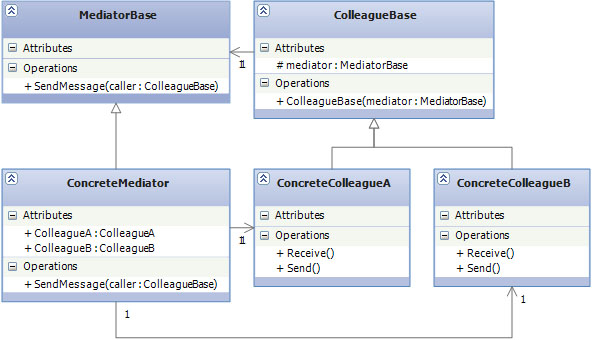

# Behavioral Design Patterns

## Mediator

* **Цел:**
	
	Този модел намалява къплинга между обектите като премахва нуждата те да директно комуникират по между си. Вместо това се създава един обект медиатор, който да обедини и енкапсулира интеракциите между класовете.

* **Използване:**
	
	В някои ситуации програмата се състои от много на брой класове. Тогава възникват проблеми, защото тези класове трябва да комуникират един с друг. Ако се използва традиционния подход, когато класовете комуникират директно, те изискват да знаят за своята вътрешна имплементация. Това може да доведе до много голяма бъркотия, защото, когато програмата става все по-сложна става и по-трудна за четене и разбиране. Тези класове са тясно свързани(къпълнати), което не е добре от гледна точка на дизайна и в бъдеще това може да доведе до проблеми.

	Mediator модела решава този проблем. Пре него комуникацията между обектите е капсулирана в отделен обект - медиатор. Вместо класовете да комуникират директно, те изпращат съобщения на медиатора и той изпраща тези съобщения на другите класове.

* **Имплементация**
	~~~c#
	public abstract class Aircraft
	{
	    private readonly IAirTrafficControl atc;
	    private int altitude;

	    public string RegistrationNumber { get; set; }

	    public int Altitude
	    {
	        get { return altitude; }
	        set
	        {
	            altitude = value;
	            atc.SendWarningMessage(this);
	        }
	    }
	 
	    public Aircraft(string registrationNumber, IAirTrafficControl atc)
	    {

	        RegistrationNumber = registrationNumber;
	        atc = atc;
	        atc.RegistrerAircraft(this);
	    }

	    public void Climb(int heightToClimb)
	    {
	        Altitude += heightToClimb;
	    }

	    public void ReceiveWarning(Aircraft reportingAircraft)
	    {
	        Console.WriteLine("ATC: ({0}) - {1} is at your flight altitude!!!",
	          this.RegistrationNumber,reportingAircraft.RegistrationNumber);
	    }
	}

	public class Airbus380 : Aircraft
	{
	    public Airbus380(string registrationNumber, IAirTrafficControl atc) : base(registrationNumber, atc)
	    {
	    }
	}

	public class Boeing747 : Aircraft
	{
	    public Boeing747(string registrationNumber, IAirTrafficControl atc) : base(registrationNumber, atc)
	    {
	    }
	}

	public class LearJet45 : Aircraft
	{
	    public LearJet45(string registrationNumber, IAirTrafficControl atc) : base(registrationNumber, atc)
	    {
	    }
	}

	public interface IAirTrafficControl
	{
	    void RegistrerAircraft(Aircraft aircraft);

	    void SendWarningMessage(Aircraft aircraft);
	}

	public class RegionalAirTrafficControl : IAirTrafficControl
	{
	    readonly List<Aircraft> registeredAircrafts = new List<Aircraft>();

	    public void RegistrerAircraft(Aircraft aircraft)
	    {
	        if (!registeredAircrafts.Contains(aircraft))
	        {
	            registeredAircrafts.Add(aircraft);
	        }
	    }

	    public void SendWarningMessage(Aircraft aircraft)
	    {
	        var list = from a in registeredAircrafts
	                   where a != aircraft &&
	                         Math.Abs(a.Altitude - aircraft.Altitude) < 1000
	                   select a;
	        foreach (var a in list)
	        {
	            a.ReceiveWarning(aircraft);
	            aircraft.Climb(1000);
	        }
	    }
	}

	class Program
	{
	    static void Main(string[] args)
	    {
	        var regionalATC = new RegionalAirTrafficControl();
	        var aircraft1 = new Airbus380("AI568", regionalATC);
	        var aircraft2 = new Boeing747("BA157", regionalATC);
	        var aircraft3 = new Airbus380("LW111", regionalATC);

	        aircraft1.Altitude += 100;

	        aircraft3.Altitude = 1100;
	    }
	}
	~~~

* **Участници**
	Симулация на самолети и контролна кула.
	- IAirTrafficControl - интерфейс на медиатора
	- RegionalAirTrafficControl - имплементация на IAirTrafficControl
	- Aircraft - абстрактен клас за всички обекти комуникиращи с IAirTrafficControl
	
	Когато един самолет промени височината си на летене, той изпраща съобщение на кулата(медиатора), тя проверява дали някой от други самолети не е в същия летателен коридор и ако има такъв, отговаря на първия самолет със съобщение да се издигне.
	

* **Структура**
	
	

	- ColleagueBase - Абстрактен клас или интерфейс за всички ConcreteColleague. Съдържа protected поле което реферира медиатора.
	
	- ConcreteColleague - Клас, имплементация на ColleagueBase. Всички такива класове трябва да комуникират по между се.

	- MediatorBase - Абстрактен клас обекта медиатор. Съдържа методи, които се използват от ConcreteColleague обектите.
	
	- ConcreateMediator - имплементира MediatorBase. Съдържа референции към всички ConcreteColleague.