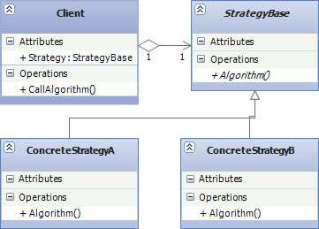

# Behavioral Design Patterns

## Strategy

* **Цел:**
	
	Strategy модела позволява на сходни алгоритми да бъдат енкапсулирани в отделни класове които наследяват общ интерфейс или абстрактен клас. Нужният алгоритъм може да се избира по време на изпълнение, според нуждите на програмата.

* **Използване:**

	Използва се в случаите, когато класове имат разлика само в поведението си. Тогава е добра идея тези алгоритми да се разделят в отделни класове, които могат да бъдат избирани по време на изпълнение. Този модел определя семейство от алгоритми, енкапсулира ги, и ги прави взаимозаменяеми. 

* **Имплементация**
	~~~c#
	public class AggresiveBehaviour:IRobotBehaviour
	{
	    public void Move()
	    {
	        Console.WriteLine("\tAggresive Behaviour: if find another robot, attack it");
	    }
	}

	public class BorgBehaviour:IRobotBehaviour
	{
	    public void Move()
	    {
	        Console.WriteLine("\tBorg Behaviour: if find another robot, assimilate it");
	    }
	}

	public class DefensiveBehaviour:IRobotBehaviour
	{
	    public void Move()
	    {
	        Console.WriteLine("\tDefensive Behaviour: if find another robot, run from it");
	    }
	}

	public class NormalBehaviour:IRobotBehaviour
	{
	    public void Move()
	    {
	        Console.WriteLine("\tNormal Behaviour: if find another robot, ignore it");
	    }
	}
	 
	public interface IRobotBehaviour
	{
	    void Move();
	}

	public class Robot
	{
	    private readonly IRobotBehaviour _behaviour;
	    private readonly string _name;
	    public Robot(string name, IRobotBehaviour behaviour)
	    {
	        _behaviour = behaviour;
	        _name = name;
	    }

	    public void Move()
	    {
	        Console.WriteLine(_name);
	        _behaviour.Move();
	    }
	}

	class Program
	{
	    static void Main()
	    {
	        var robot1 = new Robot("4of11", new BorgBehaviour());
	        var robor2 = new Robot("T1000", new AggresiveBehaviour());
	        var robot3 = new Robot("rotoROBOt", new NormalBehaviour());
	        var robot4 = new Robot("Bender", new DefensiveBehaviour());

	        robot1.Move();
	        robor2.Move();
	        robot3.Move();
	        robot4.Move();
	    }
	}
	~~~

* **Участници**
	Симулация на роботи с различно поведение.
	- IRobotBehaviour - базов интерфейс за "Behaviour" класовете
	- Robot - Клас използва IRobotBehaviour в конструктора си, може да използва всеки 
	"Behaviour" клас.

* **Структура**
	
	

	- Client - Този клас използва взаимозаменяеми алгоритми. Държи рефереция към StrategyBase.
	
	- StrategyBase - Базов клас за всички поддържани алгоритми. Client използва този клас за да извика някоя от конкретните му имплементации.
	
	- ConcreteStrategy - конкретна му имплементация на алгоритъм, наследява StrategyBase. Всеки наследник съдържа различна имплементация, която може да се използва от Client.