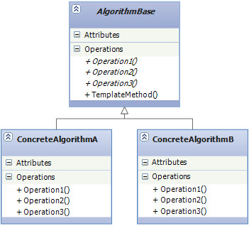

# Behavioral Design Patterns

## Template method

* **Цел:**
	
	Позволява да се обособят групи от взаимнозаменяеми, сходни по структура, многостъпкови алгоритми. Всеки алгоритъм следва една и съща последователност от стъпки, но с различна имплементация.

* **Използване:**
	
	Този модел позволява да се променя поведението на класа по време на изпълнение на програмата. Наподобява Strategy модела, но с една важна разлика. В Strategy се овъррайдва цилия алгоритъм, а тук може да се променят само някои части от поведението на алгоритъма чрез абстрактни митоди.

* **Имплементация**
	~~~c#
	public abstract class NotificationSenderBase
	{
	    protected SystemOperator operator;

	    public NotificationSenderBase(SystemOperator systemOperator)
	    {
	        operator = systemOperator;
	    }

	    protected abstract string GetNotificationMessageText();
	    

	    public abstract void Notify();

	}

	public class MailNotificationSender : NotificationSenderBase
	{
	    public MailNotificationSender(SystemOperator systemOperator) 
	    	: base(systemOperator)
	    {
	    }

	    protected override string GetNotificationMessageText()
	    {
	        return "[UNSPECIFIED ERROR OCCURED]";
	    }

	    public override void Notify()
	    {
	        Console.WriteLine(
	        "EMAIL MESSAGE:{0} WAS SET TO: {1}", GetNotificationMessageText(), operator.Email);
	    }
	}

	public class Message
	{
	    public NotificationSenderBase Sender { get; set; }

	    public void Send()
	    {
	        Sender.Notify();
	    }
	}

	public class SmsNotificationSender: NotificationSenderBase
	{
	    public SmsNotificationSender(SystemOperator systemOperator) 
	    	: base(systemOperator)
	    {
	    }

	    protected override string GetNotificationMessageText()
	    {
	        return "[UNSPECIFIED ERROR OCCURED]";
	    }

	    public override void Notify()
	    {
	        Console.WriteLine(
	        "SMS MESSAGE:{0} WAS SET TO: {1}", GetNotificationMessageText(),operator.CellPhone);
	    }
	}
	 
	public class SystemOperator
	{
	    public string Name { get; set; }
	    public string Pager { get; set; }
	    public string CellPhone { get; set; }
	    public string Email { get; set; }
	}

	class Program
	{
	    static void Main()
	    {

	        var systemOperator = new SystemOperator
	                                {
	                                    CellPhone = "145616456",
	                                    Email = "system@operator.com",
	                                    Name = "Super Operator",
	                                    Pager = "465565456"
	                                };
	        var message = new Message();

	        message.Sender = new SmsNotificationSender(systemOperator);
	        message.Send();

	        message.Sender = new MailNotificationSender(systemOperator);
	        message.Send();
	    }
	}
	~~~

* **Участници**
	- NotificationSenderBase - Основа за всички "NotificationSender" класове, има абстрактен метод  Notify().
	- Message - Използва NotificationSender

* **Структура**
	
	

	- AlgorithmBase - Опрeдeля абстрактни примитивни операции които конкретните подкласове имплементират като стъпки на алгоритъма. Имплементира template method който определя скелета на алгоритъма, последователността на стъпките.

	- ConcreteAlgorithm - Имплементира стъпките на алгоритъма. Когато ConcreteAlgorithm бъде извикан ще се изпълни template method-а от базовия клас който от своя страна ще изпълни стъпките от конкретната имплементация на всеки ConcreteAlgorithm.